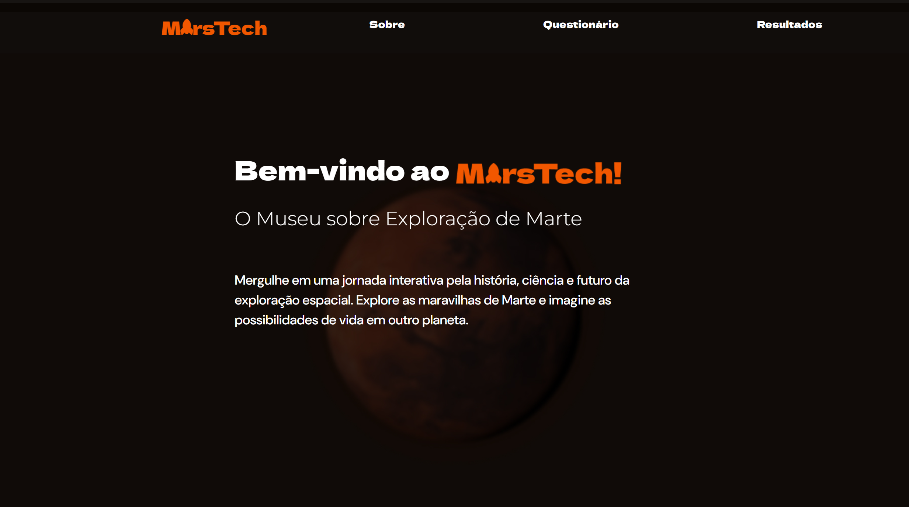

# Museu Marstech: A Possível Viagem do Homem a Marte 🟠

## Descrição do Projeto

Este projeto visa o desenvolvimento de um sistema para o **Museu Marstech**, um museu multitemático focado na possível viagem do homem a Marte. O sistema permitirá que visitantes consultem informações sobre as obras expostas e um breve histórico de cada uma através de um totem ou dispositivos móveis, como smartphones. Além disso, os visitantes serão incentivados a responder um questionário de múltipla escolha sobre sua satisfação com a exposição.

### Funcionalidades Principais
- **Consulta de Obras:** Visitantes poderão acessar detalhes sobre as obras expostas através de um totem ou dispositivos móveis.
- **Questionário de Satisfação:** Os visitantes responderão a um questionário sobre sua experiência na exposição. No final, o resultado totalizado será apresentado.
- **Campos Opcionais:** E-mail para futuros convites e um campo para sugestões diversas.
- **Relatórios:** O sistema gerará relatórios para auxiliar na tomada de decisão sobre melhorias ou encerramento da temporada de exibição.
- **Conformidade com a LGPD:** Coleta de dados não sensíveis, garantindo a privacidade dos visitantes.
- **API para Comunicação:** Desenvolvi uma API que facilita a comunicação com o banco de dados, enviando e capturando dados necessários para o serviço web e para o serviço do WPF.

### Tecnologias Utilizadas
- **Back-end:** .NET com C#.
- **Front-end Totem:** Windows Presentation Foundation (WPF).
- **Front-end Web:** HTML, CSS, e C# .NET.
- **Banco de Dados:** Persistência de dados centralizada em um servidor com acesso tanto pelo módulo Windows quanto pelo módulo Web.

## Estrutura do Projeto

1. **Análise do Sistema:** Inclui a análise realizada no semestre anterior.
2. **Desenvolvimento:**
   - **Totem:** Desenvolvido em .NET com C# e WPF.
   - **Web:** Desenvolvido em HTML, CSS, e C# .NET.
   - **API:** Desenvolvimento de uma API para comunicação com o banco de dados, garantindo a troca eficiente de dados entre o banco, o serviço Web e o serviço WPF.
3. **Diagramas:**
   - Diagrama de Classes
   - Diagrama de Sequência
   - Diagrama de Máquina de Estados
   - Diagrama de Comunicação
   - Diagrama de Pacotes
4. **Modelo de Dados:** Mapeamento Objeto-Relacional normalizado.
5. **Arquitetura do Sistema:** Projetada para garantir a integração entre os módulos.
6. **Implementação:** Projeto implementado com boas práticas de desenvolvimento em C# - .NET.
7. **Módulos:** Inclui um módulo Windows e um módulo Web responsivo, ambos utilizando um banco de dados único e com operações básicas CRUD.
8. **Boas Práticas:** Código seguindo as boas práticas de desenvolvimento de software.
9. **Cronograma:** Apresentação do cronograma do projeto.
10. **Empreendimento:** Estudo sobre a viabilidade de um empreendimento na área de desenvolvimento de sistemas.
11. **Controle de Qualidade:** Informações teóricas sobre controle de qualidade, testes automatizados, e CI/CD.

## Desenvolvimento

O sistema será projetado para ser utilizado em monitores sensíveis ao toque. Um teclado personalizado será desenvolvido dentro da aplicação, evitando o uso do teclado visual do sistema operacional. O sistema deverá suportar a coleta de dados em um servidor, hospedando tanto a parte Web quanto o banco de dados, com as mesmas funcionalidades disponíveis nos totens.

### API de Comunicação
A API desenvolvida serve como um intermediário para a comunicação entre o banco de dados e as aplicações front-end (Web e Totem), permitindo que as informações sejam enviadas e recebidas de forma eficiente e segura.

## Requisitos
- **Desenvolvimento do Totem:** Plataforma .NET com C# e WPF.
- **Desenvolvimento Web:** HTML, CSS e C# .NET.
- **Banco de Dados:** Único para todos os módulos (Totem e Web).
- **CRUD:** Implementação das operações básicas (Create, Read, Update, Delete).
- **Boas Práticas:** Seguir as melhores práticas de desenvolvimento e padrões de código.
- **Relatórios:** Implementação de relatórios baseados nas respostas dos questionários para decisões estratégicas.

## Cronograma
- Fase de Análise: [Data de início] - [Data de término]
- Fase de Desenvolvimento: [Data de início] - [Data de término]
- Testes e Implementação: [Data de início] - [Data de término]
- Apresentação Final: [Data de término]

## Controle de Qualidade
- **Testes Automatizados:** Implementação de testes unitários e de integração.
- **CI/CD:** Estudo teórico sobre a integração contínua e entrega contínua no projeto.

## Captura de Tela

Abaixo está uma captura de tela da página HTML do sistema Web:

![Print da Página HTML]

## Conclusão

O **Museu Marstech** proporciona uma experiência interativa e educativa para os visitantes, incentivando a participação ativa através de questionários e garantindo a qualidade do sistema com o uso de boas práticas de desenvolvimento e controle de qualidade.
